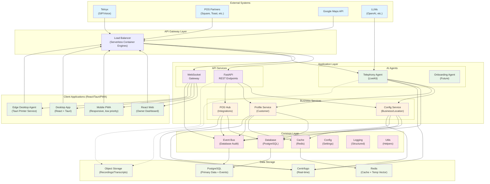
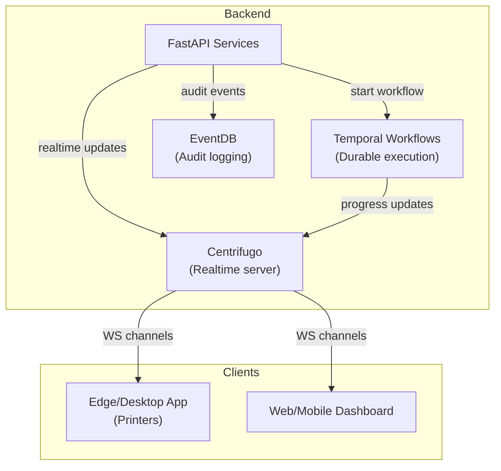

# Restaurant Phone Agent System - Architecture Design Document

## 1. Executive Summary

This document outlines the architecture for a scalable restaurant phone agent system that integrates with existing POS systems, provides personalized customer experiences, and supports multi-vertical expansion. The system is designed with incremental phases, starting from a simple MVP and evolving into a comprehensive platform serving restaurants, clinics, and other businesses.

### Key Principles
- **Business-Centric Identity**: All operational flows (printers, menus, realtime) are scoped by `business_id`. Staff accounts bind to a single business and authenticate by phone. Owners/admins manage multiple businesses and authenticate by email/username.
- **Claim-First Authentication**: JWT tokens contain all authorization data (role, business_id, permissions) eliminating database lookups on every request for maximum performance and scalability.
- **Incremental Development**: Start simple, add complexity based on traction
- **API-First Design**: All components expose standardized APIs
- **Event-Driven Architecture**: Loosely coupled services communicating via events
- **AI-Centric**: LLM agents at the core of customer interactions and business operations
- **Security by Design**: PII protection and compliance built-in from day one

## 2. System Architecture Overview

### 2.1 High-Level Component Diagram
See diagrams and implementation references in docs/ and key source files listed below.


Mid-term components being adopted (some completed):
- Temporal for workflow orchestration (replacing background job patterns).
  - Jobs are triggered by API/service methods (not directly by agents/clients).
  - Workflow progress tracked in Temporal for durable execution.
  - Future: Migrate scraping jobs to Temporal workflows.
- Centrifugo for realtime delivery to clients (Web/Mobile/Desktop, Edge).
  - Self-hosted WebSocket service.
  - Channels: `business:{business_id}` for operational updates, `job:{job_id}` for onboarding/task progress.
  - Backend publishes via HTTP API; clients subscribe via WebSocket.
  - Note: with `engine.type=memory` we run single-node unless we add a broker (Redis/NATS) or implement deterministic sharding (see `docs/capacity_and_scaling_memo.md`).
✅ fastapi-users for auth (user models, registration/login, admin ops), replacing bespoke auth utilities.
  - Code: `src/api/v1/auth.py` (routers), `src/api/auth.py` (helpers if any), `scripts/admin_set_owner_password.py`.
  - Frontend: `frontend/lib/core/auth/auth_service_v2.dart` uses `AuthApi`/`UsersApi` from generated client.
✅ OpenAPI → Dart client generation to eliminate DTO drift between FastAPI and Flutter.
  - Code: `scripts/openapi_generate_dart.sh` (generator), output in `frontend/packages/panbot_api/`.
  - Usage: `dio`-based, built_value models; referenced across frontend services.

### 2.3 Jobs and Realtime Integration (Temporal + Centrifugo)

The platform separates concerns between background jobs (Temporal workflows), audit events (EventDB), and realtime delivery to clients (Centrifugo).



Key flows:
- API/service starts Temporal workflows for long-running work (e.g., onboarding scrape).
- Workflow progress and completion tracked in Temporal for durability.
- Real-time UX updates pushed directly to Centrifugo channels from services/workflows.
- Clients (Edge/Desktop/Web/Mobile) subscribe to Centrifugo channels over WebSocket with per-channel auth.

#### Architecture Layers Explained

- **External Systems**: Third-party services we integrate with (Telnyx, POS partners, Google Maps, LLMs)
- **Client Applications (React/Tauri/PWA)**: Multi-platform clients built with web technologies and a native desktop shell
  - **React Web**: Browser-based owner dashboard with responsive design
  - **Desktop (React + Tauri)**: Windows/Linux app with POS integration, printer support, tray, autostart
  - **Mobile PWA**: Manager/owner mobile access; native apps may be added later
  - **Edge Desktop Agent**: Local printer services and hardware integration via Tauri/Rust
- **API Gateway Layer**: Load balancing and request routing (Serverless Container Engines)
- **Application Layer**: Core business logic split into:
  - **API Services**: REST endpoints and WebSocket gateway for real-time connections
  - **AI Agents**: Voice processing and conversation management
  - **Business Services**: Domain-specific business logic
- **Common Layer**: Shared utilities and cross-cutting concerns (see `src/common/`)
- **Data Storage**: Persistent and temporary data stores

### 2.2 Core Components

#### 2.2.1 Telephony Agent Service
- **Purpose**: Handle real-time voice interactions via SIP/WebRTC
- **Technology**: Python with LiveKit SDK, based on existing `agent.py` and `restaurant_agent.py`
- **Key Features**:
  - Stateless design with in-memory working context
  - Real-time ASR/LLM/TTS processing
  - Multi-layered memory system
  - Function tools for backend integration
  - Event emission for all significant actions

#### 2.2.1.1 Agent Tool Interface
- **Function Tools**: LiveKit `@function_tool` decorators provide LLM access to backend operations
- **Service Integration**: Tools call `src/services/...` methods directly (in-process)
- **Architecture Boundary**: Agents → Services → Common; agents never touch DB/Redis directly
- **Tool Categories**:
  - Context loading: `get_business_by_phone()`, `get_customer_by_phone()`, `get_menu_data()`
  - Order management: `create_order()`, `update_order()`, `get_order_status()`
  - Customer service: `lookup_previous_orders()`, `update_customer_preferences()`
- **Error Handling**: Tools return structured responses; services handle validation and emit events
- **Metrics**: Tool execution times, success/failure rates, and business KPIs tracked automatically

#### 2.2.2 Configuration & Profile Service
- **Purpose**: Centralized management of business and customer data
- **Technology**: FastAPI with SQLModel/Pydantic
- **Key Features**:
  - RESTful CRUD APIs for all entities
  - Phone number-based customer lookup
  - Cross-vertical profile support
  - Webhook management for real-time updates

#### 2.2.3 POS Integration Hub
- **Purpose**: Normalize communication with various POS systems
- **Technology**: Microservice architecture with adapter pattern
- **Key Features**:
  - Partner-specific adapters
  - Direct API/webhook processing
  - Human fallback mechanisms
  - Bi-directional data flow (push/pull)

#### 2.2.4 Onboarding Service
- **Purpose**: Streamline restaurant registration and setup
- **Technology**: Next.js frontend with FastAPI backend
- **Key Features**:
  - Google Maps URL intake and Places lookup
  - Wizard-based setup: Identify → Confirm → Verify (phone call to business line) → Account → Review → Go-live
  - Temporary test number provisioning for live demo
  - Routing numbers registration (forwarding and fallback)
  - POS integration testing (future)
  - Google Business Profile OAuth (future)

#### 2.2.5 Optional MCP Adapter (Future)
- **Purpose**: Expose curated tool surface for external LLM agents
- **Technology**: Model Context Protocol (MCP) server over HTTP/WebSocket
- **Scope**: Narrow, versioned tool catalog mapped to existing service methods
- **Use Cases**: Third-party AI agents, partner integrations, external automation
- **Security**: Strict authentication, rate limiting, audit logging
- **Architecture**: MCP requests → Service methods (same as agent tools) → Events/DB
- **Timeline**: Backlog item; implement only when concrete external agent use case emerges

**Note**: Primary external interfaces remain REST APIs + WebSocket gateway. MCP is supplementary for specialized AI agent integrations.

#### 2.2.6 Common Layer (`src/common/`)

The common layer provides shared utilities and cross-cutting concerns used across all application layers:

| Module | Purpose | Key Features |
|--------|---------|--------------|
| `config.py` | Environment and settings management | Pydantic settings, multi-tenant env support |
| `database.py` | Database connection utilities | Session management, connection pooling |
| `cache.py` | Redis caching layer | Structured caching, TTL management, vector storage support |
| `event_bus.py` | Database audit logging | Event publishing to EventDB, Centrifugo integration |
| `logging.py` | Structured logging | JSON logging, correlation IDs, performance tracking |
| `utils.py` | General utilities | Data serialization, validation helpers, common functions |
| `errors.py` | Exception handling | Custom exceptions, error responses, validation errors |

**Architecture Rules:**
- **One-way dependencies**: Common layer never imports from services/api/agents
- **Shared by all**: Used by API services, business services, and AI agents
- **Configuration-driven**: Behavior controlled by environment variables and YAML files
- **Testable**: Designed for easy mocking and unit testing

## 3. Data Architecture

### 3.1 Primary Database Schema (PostgreSQL)

The database schema is implemented using SQLModel/SQLAlchemy with the following core entities. For complete model definitions, see `src/models/database.py`:

#### Core Tables

| Table | Purpose | Key Features |
|-------|---------|--------------|
| `businesses` | Unified business/location entity (primary operational identity) | Legal name, display name, phone numbers (primary + forwarding), hours, menu data, POS config, timezone, address, media/about info |
| `customers` | Customer profiles with privacy protection | Phone/email hashes (SHA-256), preferences, opt-in status |
| `calls` | Call session tracking | Session ID, participants, duration, status, recording URL |
| `sessions` | Detailed conversation data | Agent memory, conversation history, metadata |
| `orders` | Order management | Items, totals, payment status, scheduling |
| `pos_integrations` | POS system configurations | Provider-specific API configs, webhooks, sync status |
| `events` | Audit event logging | Event type, entity references, JSON payload for compliance |
| `api_keys` | Authentication tokens | Hashed keys, permissions, business association |

#### Schema Features

- **UUID Primary Keys**: All tables use UUIDs for distributed-friendly IDs
- **JSONB Columns**: Flexible schema for configuration, metadata, and event payloads
- **Privacy by Design**: Phone numbers and emails stored as SHA-256 hashes
- **Audit Trail**: Created/updated timestamps on all entities
- **Index Optimization**: Strategic indexes for common query patterns

#### Database Models

The schema is implemented in `src/models/database.py` with:
- **Enums**: `BusinessStatus`, `BusinessType`, `CallStatus`, `PaymentStatus`
- **SQLModel Classes**: All tables inherit from `BaseDBModel` with common fields
- **Type Safety**: Full Pydantic validation and SQLAlchemy ORM support

#### Migration Management

- **Alembic**: Database migrations in `migrations/versions/`
- **Current Schema**: Complete schema from migration `f42ce5f02025`
- **Environment Support**: Separate databases per tenant (dev/staging/prod)

### 3.1.1 Identity Model (Unified Business-as-Location)

- The `businesses` table is the primary operational entity. Each row represents a single operational location (for chains, each location is its own business record).
- Staff users: `role='staff'`, login with phone; staff are bound to a single business row via `users.business_id`.
- Owner/Admin users: `role in {'owner','admin'}`, login with email/username; can manage multiple businesses (future `user_businesses` link table if needed). Desktop edge client is staff-only.
- All operational flows (printers, menus, realtime) use `business_id` as the location identifier.

### 3.1.2 Authentication Architecture

**Claim-First JWT Model**: The system uses JWT tokens containing all necessary authorization data to eliminate database lookups on every request while maintaining security through token versioning.

**Key Features**:
- **Zero-DB Auth**: Standard requests authorize from JWT claims only (role, business_id, permissions)
- **Optional Validation**: `AUTH_VALIDATE_DB_ON_REQUEST` flag enables DB validation for sensitive operations
- **Token Versioning**: `users.token_version` enables server-side token revocation
- **FastAPI Caching**: Dependency injection caches JWT decoding per request
- **Horizontal Scaling**: No shared session state required

**Implementation Details**: See `docs/PRODUCTION_REALTIME_AUTH.md` for complete authentication setup, configuration options, and security considerations.

### 3.1.4 Edge Data Consistency Architecture

**Single Source of Truth DTO Pattern**: The system uses versioned Data Transfer Objects (DTOs) to maintain consistency between desktop clients and backend services, eliminating data loss during transmission and reload operations.

**Key Features**:
- **EdgePrinterProfile v1**: Canonical DTO for all printer profile operations
- **Local SQLite Cache**: Desktop offline-first storage using tauri-plugin-sql
- **Identity-Based Lookups**: Immutable keys (printer_uuid, mac_address) for reliable data retrieval
- **Schema Versioning**: Built-in migration support for production data evolution
- **Network Hints Preservation**: Critical connectivity data (IP, port) always available for printing

**Implementation Details**: See `docs/EDGE_PRINTER_DTO_IMPLEMENTATION.md` for complete DTO system design, implementation instructions, and migration strategies.

### 3.1.5 Phone Number Management

- **Primary Phone**: `businesses.phone_number` - the main business line
- **Additional Lines**: `business_phone_numbers` table for unlimited additional phone numbers per business
  - Each entry: `business_id`, `phone_e164`, `label` (e.g., "Takeout", "Catering"), `priority`
  - Unique constraint on `phone_e164` across all businesses
- **Call Routing**: Incoming calls matched by checking primary phone OR any additional phone numbers
- **SIP Integration**: Customer calls restaurant number → forwards to Telnyx → SIP header contains original restaurant number for business identification

### 3.2 Object Storage Structure (S3/GCS)

```text
/recordings/
  /{year}/{month}/{day}/{call_id}.mp3
/transcripts/
  /{year}/{month}/{day}/{transcript_id}.json
/menus/
  /{business_id}/menu-{version}.json
/analytics/
  /exports/{date}/
```

### 3.3 Caching Strategy (Redis)

- **Session State**: Active call sessions (TTL: 1 hour)
- **Restaurant Context**: Menu, hours, POS config (TTL: 5 minutes)
- **Customer Context**: Recent orders, preferences (TTL: 30 minutes)
- **Rate Limiting**: API call counters per client

## 4. Security & Compliance

### 4.1 PII Protection
- **Phone Number Handling**: Store only SHA-256 hashes in main database
- **Encryption**: AES-256 for sensitive data at rest
- **Key Management**: AWS KMS or HashiCorp Vault
- **Access Control**: RBAC with Auth0/Clerk integration

### 4.2 Network Security
- **TLS 1.3**: All external communications
- **VPC Isolation**: Private subnets for internal services
- **API Gateway**: Rate limiting and DDoS protection
- **Secrets Management**: Environment variables via Pydantic BaseSettings

### 4.3 Compliance Readiness
- **PCI DSS**: No direct card handling, use tokenization
- **GDPR**: Data deletion and export capabilities
- **HIPAA**: Isolated infrastructure for healthcare vertical

## 5. API Design Standards

### 5.1 RESTful API Conventions

```python
# FastAPI endpoint example
from fastapi import APIRouter, Depends, HTTPException
from sqlmodel import Session
from typing import List
import uuid

router = APIRouter(prefix="/api/v1")

@router.get("/businesses/{business_id}", response_model=BusinessResponse)
async def get_business(
    business_id: uuid.UUID,
    db: Session = Depends(get_db),
    current_user: User = Depends(get_current_user)
):
    """Get business details by ID"""
    # Implementation
```

### 5.2 Event Schema Standards

The event system uses database audit logging with Centrifugo for real-time messaging. Events are standardized using Pydantic models.

#### Event Models (src/common/event_bus.py)

```python
from pydantic import BaseModel, Field
from datetime import datetime, timezone
import uuid

class BaseEvent(BaseModel):
    """Base event model for all system events."""
    event_id: uuid.UUID = Field(default_factory=uuid.uuid4)
    event_type: str
    entity_type: str
    entity_id: uuid.UUID
    timestamp: datetime = Field(default_factory=lambda: datetime.now(timezone.utc))
    payload: Dict[str, Any] = Field(default_factory=dict)
    metadata: Dict[str, Any] = Field(default_factory=dict)

class CallStartedEvent(BaseEvent):
    """Call session started event."""
    event_type: str = EventType.CALL_STARTED.value
    entity_type: str = "call"

class OrderCreatedEvent(BaseEvent):
    """Order created event."""
    event_type: str = EventType.ORDER_CREATED.value
    entity_type: str = "order"
```

Implementation details are in `src/common/event_bus.py`.

#### Event Message Structure

Events are stored in PostgreSQL `events` table with:
- **event_type**: String identifier (e.g., "order.created")
- **entity_type/entity_id**: What the event relates to
- **timestamp**: UTC timestamp
- **payload**: JSON data with event-specific details
- **metadata**: Additional context

#### Event Publishing

Events are published using the `event_publisher` from `src.common.events`:
- **Database**: Events stored in `EventDB` table for audit/compliance
- **Real-time**: Critical events sent to Centrifugo for client notifications
- **Consistency**: Same event models used across database and real-time channels

### 5.3 Communication Patterns & Implementation Guidelines

#### When to Use Event Publishing

**Use events for:**
- **Business-critical actions**: Order creation, call completion, customer registration
- **Audit logging**: Compliance and analytics data persistence
- **Real-time notifications**: Client-side updates via Centrifugo
- **Asynchronous processing**: Operations that don't need immediate response
- **External integrations**: Notifying POS systems or third-party services

```python
# ✅ Good: Use events for significant business actions
await events.event_publisher.publish_order_created(
    order_id=order.id,
    business_id=order.business_id,
    order_data=order_data,
    db=db  # Required for database persistence
)
```

**Don't use events for:**
- Direct API responses to users
- Simple internal method calls within the same service
- Real-time synchronous operations (use direct method calls)

#### When to Use Temporal Workflows

Use Temporal for:
- **Durable long-running jobs**: scraping, validation, POS sync tasks
- **Complex workflows**: multi-step processes with failure handling
- **Stateful operations**: workflows that need to resume after failures
- **Idempotent tasks**: tasks must be safe to retry

Do not use Temporal for:
- Simple synchronous operations
- Real-time UI updates (use Centrifugo)

Pattern:
```python
# API/service starts Temporal workflow
workflow_id = await temporal_client.start_workflow(
    "OnboardingScrapeWorkflow",
    args=[payload]
)

# Workflow emits progress events via Centrifugo
from src.common.centrifugo import publish_job_progress

await publish_job_progress(
    job_id=str(workflow_id),
    progress=35,
    message="Fetching menu"
)
```

#### When to Use Common Layer

**Use Common Layer (`src/common/`) for:**
- **Database access**: Use `database.py` for session management
- **Caching**: Use `cache.py` for Redis operations
- **Configuration**: Use `config.py` for settings and environment variables
- **Logging**: Use `logging.py` for structured logging
- **Utilities**: Use `utils.py` for data transformation and validation
- **Error handling**: Use `errors.py` for custom exceptions

```python
# ✅ Good: Use common layer for shared functionality
from src.common.database import get_db
from src.common.cache import get_cache_client
from src.common.logging import setup_logging

logger = setup_logging("order-service")
```

**Architecture Rule**: Common layer never imports from `services/`, `api/`, or `agents/` - only the reverse.

#### When to Use WebSockets

**WebSockets are specifically for:**

1. **Edge Client Communication** (Printer Integration):
   ```python
   # Edge client connects to receive print jobs
   websocket_url = "wss://api.panbot.com/ws/locations/{location_id}"
   # Receives: order receipts, status updates, configuration changes
   ```

2. **User Interface Real-time Updates** (Web/Mobile Dashboards):
   ```python
   # Owner dashboard connects to receive real-time updates
   websocket_url = "wss://api.panbot.com/ws/locations/{location_id}"
   # Receives: new orders, call notifications, system alerts
   ```

3. **Administrative Monitoring**:
   ```python
   # Admin interfaces for support and monitoring
   websocket_url = "wss://api.panbot.com/ws/locations/{location_id}"
   # Note: Admin connections can monitor multiple locations by opening multiple connections
   ```

See `src/services/websocket_gateway.py` and `src/api/websocket.py`. New deployments will migrate these flows to Centrifugo channels with history/recovery. Services publish to Centrifugo via HTTP API; clients subscribe to `business:{business_id}` and `job:{job_id}` channels.

**Key Principles**:
- Services publish to EventDB for audit logging and Centrifugo for real-time updates
- Use structured event models across all services
- Events are scoped by business_id for proper tenant isolation
- Scale horizontally via partitions and consumer group instances

#### Realtime Delivery Architecture (Centrifugo)

The realtime layer is provided by Centrifugo v6. In the current deployment we run `engine.type=memory` and treat Centrifugo as **single-node** (see scaling constraint in `docs/capacity_and_scaling_memo.md`). The system uses a **Single Source of Truth (SSOT)** approach for namespace configuration to prevent channel mismatches.

**Configuration Architecture:**
- **SSOT**: `infrastructure/centrifugo/config.json` defines all namespaces and channel behaviors
- **Generated Constants**: Auto-generated backend (`src/common/realtime/namespaces.py`) and frontend (`apps/desktop/src/lib/realtimeNamespaces.ts`) constants
- **Runtime Validation**: API startup validates all required namespaces are configured
- **CI Integration**: `make dev` automatically regenerates constants

**Namespace Management Pattern:**
```python
# Backend: Use generated constants
from src.common.realtime.namespaces import channel_for_business
channel = channel_for_business(business_id)  # "business:uuid"

# Frontend: Use generated constants  
import { channelForBusiness } from './realtimeNamespaces';
const channel = channelForBusiness(businessId);  // "business:uuid"
```

**Available Namespaces:**
- `business:{business_id}` - Business-scoped updates (orders, printer status, operational alerts)
- `job:{job_id}` - Background job progress (onboarding, scraping)
- `location:{location_id}` - Legacy location channels (maps to business)
- `admin:{entity_id}` - System admin notifications

**Features:**
- **Channels & History**: Message history and recovery on reconnect
- **Presence**: Online presence per channel
- **JWT Auth**: Token-based channel access via backend API
- **Note on durability**: channel history is in-memory in the current deployment; durable recovery is Postgres + periodic sync.

**Critical Rule:** Never hardcode channel names like `"business:uuid"` - always use generated helper functions to maintain SSOT consistency.

Implementation details: `docs/CENTRIFUGO_CORS_AND_DESKTOP_APPS.md`

#### Communication Matrix

| Use Case | Pattern | Technology | Example |
|----------|---------|------------|---------|
| API Response | Synchronous | HTTP/REST | Get menu items |
| Business Event | Asynchronous | EventDB + Centrifugo | Order created |
| Real-time UI Update | Push | WebSocket (Centrifugo) | New order notification |
| Edge Device Command | Push | WebSocket (Centrifugo) | Print receipt command |
| Service-to-Service | Direct/Events | HTTP/EventDB | POS sync trigger |
| Shared Utilities | Import | Common Layer | Database session |

#### Event Publishing Best Practices

**Event Strategy:**
- ✅ **Database-first**: All events stored in EventDB for audit/compliance
- ✅ **Selective real-time**: Only critical events sent to Centrifugo for client notifications
- ✅ **Structured payloads**: Use consistent Pydantic models across all events

**Scaling Considerations:**
- Database events: Scale with PostgreSQL read replicas for analytics
- Real-time events: Centrifugo is single-node by default unless broker/sharding is implemented
- Event filtering: Client-side filtering for different user roles/permissions

**Performance Considerations:**
- Event publishing: Async database writes, don't block API responses
- Real-time delivery: keep payloads small; prefer history TTL sized to brief reconnects and rely on Postgres for durable recovery
- Audit logging: EventDB queries optimized with proper indexing

**At Scale (1000+ locations):**
- Consider event archiving strategies for long-term storage
- Implement event sampling for high-volume operations
- Use Redis for event caching if needed for performance

## 6. Development Phases

  +### Phase 0: Foundation (Completed)
- Core agent and API foundations consolidated
- PostgreSQL schema created via Alembic (`businesses` [unified], `customers`, `calls`, `orders`, `sessions`, `events`, `pos_integrations`, `api_keys`)
- EventDB and Centrifugo integrated for audit logging and real-time messaging
- Docker Compose for local development

### Phase 1: MVP Launch (Completed core backend slice)
- Agent can create orders; events are published to EventDB and sent to Centrifugo for real-time updates
- API exposes health, businesses, locations, menus, orders, WebSocket gateway
- Deployed to Serverless Container Engines (API + Agent)
- Object storage for recordings/transcripts: metadata columns are present; storage integration is next

### Phase 2: Desktop (Tauri/React) & Web PWA (Next)
- Desktop App (React + Tauri): OS printer enumeration (WinSpool/CUPS/IPP), LAN discovery (mDNS/IPP), receipt and kitchen ticket printing (spooler + ESC/POS 9100), tray/autostart, updater
- Web Dashboard (React PWA): monitoring (recordings, transcripts, receipts, volumes) and configuration (menu, customer preferences)
- Realtime: Centrifugo via `centrifuge-js` (channels `location:{location_id}`, `job:{job_id}`)
- Mobile: responsive PWA; push via web notifications where available
- POS Integrations: begin OAuth and menu sync for an initial partner; stub endpoints and webhooks

### Phase 3: Intelligence & Expansion (Months 4-6)
- Add vector database for semantic search
- Implement long-term memory system
- Build analytics warehouse
- Add onboarding AI agent
- Prepare for multi-vertical support

## 7. Technology Stack

### 7.1 Core Technologies
- **Backend Language**: Python 3.13+ with `uv` package manager
- **Frontend Framework**: React 18+ (Vite) for web; Tauri (Rust + WebView) for desktop
- **Web Framework**: FastAPI with Pydantic v2
- **Database**: PostgreSQL 15+ with SQLModel (includes EventDB)
- **Caching**: Redis 7+
- **Real-time**: Centrifugo (self-hosted WebSocket service)
- **Workflows**: Temporal (future durable execution)
- **Container**: Docker with Docker Compose

### 7.2 AI/ML Stack
- **LLM**: OpenAI GPT-5
- **Voice**: LiveKit with Deepgram/ElevenLabs
- **Embeddings**: OpenAI Ada or Sentence Transformers
- **Vector DB**: Pinecone or pgvector (target); Redis used temporarily for embeddings

### 7.3 Infrastructure
- **Cloud**: Serverless Container Engines for API and Agent services (current); AWS/GCP multi-region in future phases
- **Orchestration**: Serverless Container Engines (current); Kubernetes with Helm deferred until scale requires it
- **Datastores**: Managed PostgreSQL (with EventDB), Redis (cache), Centrifugo (real-time)
- **Workflows**: Temporal for durable job execution (future)
- **CI/CD**: GitHub Actions (planned)
- **Monitoring**: Prometheus + Grafana (planned), basic cloud logs (Langfuse)
- **Logging**: Loki or ELK stack (planned)
- **APM**: Sentry + OpenTelemetry (planned)

## 8. Operational Excellence

### 8.1 Monitoring & Alerting
- **SLIs**: Call success rate, latency, POS sync success
- **SLOs**: 99.9% uptime, <2s response time
- **Alerts**: PagerDuty integration for critical issues

### 8.2 Testing Strategy
- **Unit Tests**: 80% coverage with pytest
- **Integration Tests**: API and POS adapter testing
- **Synthetic Monitoring**: Automated test calls
- **Load Testing**: K6 or Locust for performance

### 8.3 Deployment Pipeline
```yaml
# GitHub Actions example
name: Deploy
on:
  push:
    branches: [main]
jobs:
  test:
    runs-on: ubuntu-latest
    steps:
      - uses: actions/checkout@v3
      - name: Set up Python
        uses: actions/setup-python@v4
      - name: Install uv
        run: pip install uv
      - name: Run tests
        run: uv run pytest
  deploy:
    needs: test
    # Deployment steps
```

## 9. Scalability Considerations

### 9.1 Horizontal Scaling
- Stateless services for easy scaling
- Load balancing with health checks
- Auto-scaling based on CPU/memory metrics

### 9.2 Data Partitioning
- Partition calls/orders by date
- Shard customers by phone_hash
- Read replicas for analytics

### 9.3 Performance Optimization
- Connection pooling for databases
- Batch processing for analytics
- CDN for static assets
- Edge caching for API responses

## 10. Future Enhancements

### 10.1 Advanced AI Features
- Multi-modal understanding (voice + images)
- Predictive ordering based on patterns
- Sentiment analysis and call quality scoring
- Automated menu updates from photos

### 10.2 Business Intelligence
- Real-time dashboards for restaurants
- Predictive analytics for demand
- Customer segmentation
- Revenue optimization suggestions

### 10.3 Platform Expansion
- Mobile SDK for direct integration
- White-label solution for chains
- Marketplace for third-party integrations
- International expansion with multi-language support

## 11. Capacity & Scaling Profiles

For resource sizing of the API and Telephony Agent across growth stages, see the memo:
- docs/capacity_and_scaling_memo.md

Implementation guidance for engineers and AI agents:
- docs/ai_dev_instructions_scaling.md